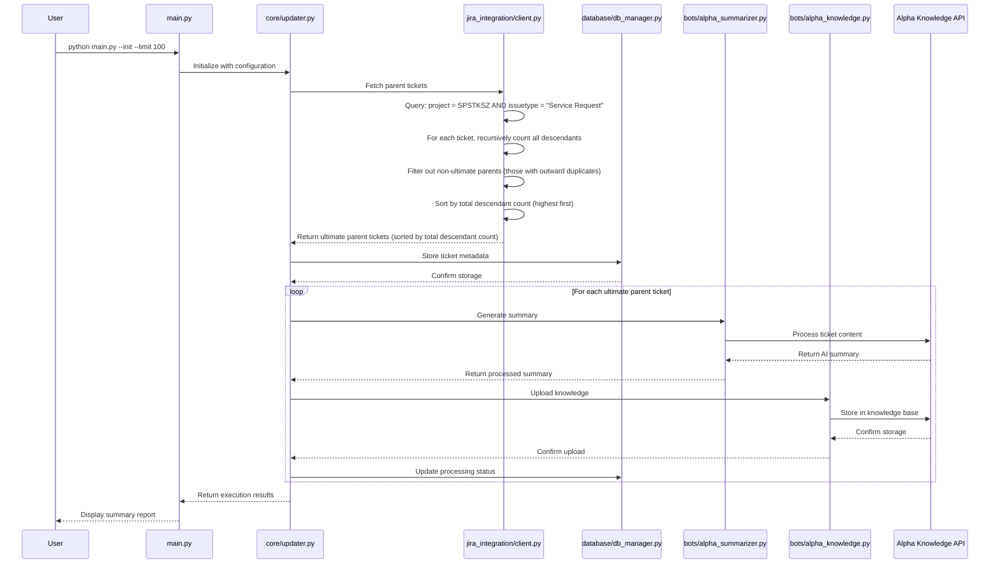

# Feedback Knowledge Updater

A Python application that processes JIRA tickets and maintains Alpha Knowledge knowledge bases. The system fetches parent tickets with their child tickets from JIRA, generates summaries, and uploads this knowledge to Alpha Knowledge.

## Step 1: Get the Code

Clone the repository from GitHub:

```bash
git clone https://github.com/agentcluck77/JIRA-feedback-knowledge-updater.git
cd JIRA-feedback-knowledge-updater
```

## Step 2: Installation

Choose one installation method:

### Option A: UV (Recommended - Faster)
```bash
# Install UV package manager
curl -LsSf https://astral.sh/uv/install.sh | sh

# Install dependencies
uv sync
source .venv/bin/activate  # On macOS/Linux
# .venv\Scripts\activate   # On Windows
```

### Option B: Traditional Pip
```bash
pip install -r requirements.txt
```

**Verify installation:**
```bash
python main.py --help
# Should display command options without errors
```

## Step 3: JIRA Configuration

### 3.1 Create Environment File
```bash
cp .env.example .env
```
### 3.2 Configure JIRA Settings
Edit `.env` file and update these **4 required settings**:

```bash
# Your JIRA instance URL (must include https://)
JIRA_SERVER=https://yourcompany.atlassian.net

# Your JIRA account email
JIRA_USERNAME=your-email@company.com

# The API token from step 2.2
JIRA_PASSWORD=ATATT3xFfGF0T9E2bN8vQ...

# SSL verification (keep as true)
JIRA_VERIFY=true
```

**⚠️ Do NOT modify** `JIRA_PROJECT_KEY` or `JIRA_PARENT_QUERY` unless you need different ticket queries.

### 3.3 Test JIRA Connection
```bash
python main.py --interactive
# Select: "Test JIRA connection"
# Should show: "✅ JIRA connection successful"
```

## Step 4: Bot Configuration

You need to configure both classifier and summarizer bots. The system supports two bot types:

### 4.1 Alpha Knowledge (Recommended)
**Requirements:** 
- `expert_id` (numeric ID from Alpha Knowledge platform)
- `api_key` (Alpha Knowledge API key)
- `url` (Alpha Knowledge API endpoint)

### 4.2 AI Bot Platform (Legacy)
**Requirements:**
- `app_id` (Application ID)
- `user_email` (Bot user email)
- `app_secret` (Application secret key)
- `url` (Bot API endpoint)

### 4.3 Configure Bots (Interactive Method - Recommended)

**Step 1: Configure Classifier Bot**
```bash
python main.py
# Select: "Manage classifier bot configurations"
# Select: "Add new classifier bot"
# Follow the prompts to enter your bot credentials
```

**Step 2: Configure Summarizer Bot**
```bash
python main.py
# Select: "Manage summarizer bot configurations"
# Select: "Add new summarizer bot"
# Follow the prompts to enter your bot credentials
```

### 4.4 Alternative: Manual JSON Configuration
```bash
# Copy example files
cp classifier_bots_config.json.example classifier_bots_config.json
cp summarizer_bots_config.json.example summarizer_bots_config.json

# Edit both JSON files with your bot credentials
```

**Classifier Bot Example (Alpha Knowledge):**
```json
{
  "production_bot": {
    "bot_type": "alpha_knowledge",
    "url": "https://knowledge.alpha.yourcompany.com/api",
    "expert_id": "12345",
    "api_key": "ak_live_xyz123abc456def789"
  }
}
```

**Summarizer Bot Example (Alpha Knowledge):**
```json
{
  "default": {
    "bot_type": "alpha_knowledge",
    "url": "https://knowledge.alpha.yourcompany.com/api",
    "expert_id": "67890",
    "api_key": "ak_live_summarizer_abc123xyz"
  }
}
```

**AI Bot Platform Example (Legacy):**
```json
{
  "legacy_bot": {
    "bot_type": "ai_bot_platform", 
    "url": "https://bot.yourcompany.com/api/chat",
    "app_id": "app_abc123",
    "user_email": "knowledge-bot@yourcompany.com",
    "app_secret": "secret_xyz789"
  }
}
```

### 4.5 Test Bot Configuration
```bash
python main.py --list-bots
# Should display both classifier and summarizer bots without errors
```

## Step 5: Initialize Knowledge Base

### 5.1 First Run (Interactive Mode)
```bash
python main.py
# Select: "Initialize new knowledge base"
# Choose your classifier bot
# Set limit (recommend 50-100 for first run)
# Confirm to start processing
```

### 5.2 First Run (Command Line)
```bash
# Process top 100 tickets by child count
python main.py --init --limit 100 --classifier-bot CLASSIFIER_BOT --summarizer-bot SUMMARIZER_BOT

# With verbose logging
python main.py --init --limit 100 --classifier-bot CLASSIFIER_BOT --summarizer-bot SUMMARIZER_BOT --verbose
```

**What happens during initialization:**
1. Fetches parent tickets from JIRA using configured query
2. Filters to ultimate parent tickets only (removes tickets with outward duplicates)
3. Sorts by total descendant count (highest priority first)
4. Generates AI summaries using summarizer bot
5. Uploads processed knowledge to classifier bot
6. Stores processing state in SQLite database (`feedback_updater.db`)

### 5.3 Verify Successful Initialization
```bash
# Check logs for errors
tail -50 feedback_updater.log

# Verify database was created
ls -la feedback_updater.db

# Check your bot's knowledge base
# Log into your Alpha Knowledge/AI Bot Platform and verify tickets appear
```

## Step 6: Regular Updates

### Weekly Updates 
```bash
# Maintain 200 tickets, adding new ones and removing old ones
python main.py --limit 200 --classifier-bot CLASSIFIER_BOT --summarizer-bot SUMMARIZER_BOT

# Or use interactive mode
python main.py
# Select: "Update existing knowledge base"
```

### Scaling Operations
```bash
# Increase to 220 tickets
python main.py --resize 220 --classifier-bot CLASSIFIER_BOT --summarizer-bot SUMMARIZER_BOT

# Force refresh all existing tickets (if bot knowledge seems stale)
python main.py --force-refresh --classifier-bot CLASSIFIER_BOT --summarizer-bot SUMMARIZER_BOT
```

### Monitoring and Maintenance
```bash
# View system status
python main.py --interactive
# Select: "View system status"

# Check recent logs
tail -f feedback_updater.log

# Search for errors
grep -i error feedback_updater.log | tail -20

# Backup database
cp feedback_updater.db "backup_$(date +%Y%m%d).db"
```

## Command Reference

| Command | Description |
|---------|-------------|
| `python main.py` | Interactive mode (recommended for new users) |
| `python main.py --list-bots` | Show configured bots |
| `python main.py --init --limit N --classifier-bot CLASSIFIER_BOT --summarizer-bot SUMMARIZER_BOT` | Initialize with N tickets |
| `python main.py --limit N --classifier-bot CLASSIFIER_BOT --summarizer-bot SUMMARIZER_BOT` | Update to maintain N tickets |
| `python main.py --resize N --classifier-bot CLASSIFIER_BOT --summarizer-bot SUMMARIZER_BOT` | Resize to exactly N tickets |
| `python main.py --force-refresh --classifier-bot CLASSIFIER_BOT --summarizer-bot SUMMARIZER_BOT` | Refresh all existing tickets |
| `python main.py --test-update TICKET_KEY --classifier-bot CLASSIFIER_BOT --summarizer-bot SUMMARIZER_BOT` | Test with specific ticket |
| `python main.py --verbose --classifier-bot CLASSIFIER_BOT --summarizer-bot SUMMARIZER_BOT` | Enable debug logging |

## Troubleshooting

### Common Issues

**"No classifier bots configured"**
```bash
# Solution: Configure at least one bot
python main.py
# Select: "Manage classifier bot configurations"
```

**"JIRA connection failed"**
```bash
# Check .env file settings
# Verify API token is valid and not expired
# Test connection in interactive mode
python main.py --interactive
```

**"Bot authentication failed"**
```bash
# Verify credentials in classifier_bots_config.json
# Check bot_type matches your system (alpha_knowledge vs ai_bot_platform)
# Ensure URL endpoints are correct and accessible
```

**"No tickets found"**
```bash
# Verify JIRA_PARENT_QUERY returns results
# Test query directly in JIRA Issues search
# Check project permissions for your JIRA user
```

**"Permission denied" (403 Forbidden)**
```bash
# Ensure JIRA user has these permissions:
# - Browse Projects
# - View Issues  
# - Access to target project
# Verify API token belongs to correct user
```

**"Module not found" errors**
```bash
# Activate virtual environment
source .venv/bin/activate  # Linux/macOS
# Reinstall dependencies
pip install -r requirements.txt
```

**"Database locked" errors**
```bash
# Close other application instances
# If persistent, backup and reset:
cp feedback_updater.db backup.db
rm feedback_updater.db
python main.py --init --limit 50 --classifier-bot CLASSIFIER_BOT --summarizer-bot SUMMARIZER_BOT
```

### Log Analysis
```bash
# View recent activity
tail -100 feedback_updater.log

# Check processing status
grep -i "processed\|uploaded\|failed" feedback_updater.log

# Monitor in real-time
tail -f feedback_updater.log
```

## Architecture Overview

### System Components

The application uses a modular architecture:

- **main.py**: CLI entry point and argument parsing
- **core/updater.py**: Main orchestration and business logic
- **database/db_manager.py**: SQLite operations for ticket tracking
- **jira_integration/client.py**: JIRA API client for ticket fetching
- **bots/alpha_knowledge.py**: Alpha Knowledge API integration
- **bots/alpha_summarizer.py**: Alpha Summarizer API integration  
- **config/**: Configuration management and validation
- **ui/interactive.py**: Interactive menu system

### Data Flow

1. **Fetch**: Retrieve parent tickets from JIRA using JQL query
2. **Sort**: Order by child ticket count (higher = higher priority)
3. **Summarize**: Generate AI summaries using configured summarizer bot
4. **Upload**: Send processed knowledge to classifier bot's knowledge base
5. **Track**: Store processing state in SQLite database

### Project Structure

```
feedback-knowledge-updater/
├── main.py                                    # Main entry point
├── .env                                       # JIRA configuration (you create this)
├── .env.example                               # JIRA configuration template
├── classifier_bots_config.json               # Your bot configurations 
├── classifier_bots_config.json.example       # Bot config template
├── summarizer_bots_config.json               # Your summarizer configurations 
├── summarizer_bots_config.json.example       # Summarizer config template
├── pyproject.toml                             # UV/pip dependencies
├── requirements.txt                           # Traditional pip dependencies
├── config/
│   ├── settings.py                            # Environment configuration
│   └── bot_config.py                          # Bot management
├── core/
│   └── updater.py                             # Main orchestration
├── database/
│   └── db_manager.py                          # SQLite operations
├── jira_integration/
│   └── client.py                              # JIRA API client
├── bots/
│   ├── alpha_knowledge.py                     # Alpha Knowledge integration
│   └── alpha_summarizer.py                    # Alpha Summarizer integration
└── ui/
    └── interactive.py                         # Interactive menu system
```

### Generated Files (After First Run)
```
├── feedback_updater.db                       # SQLite database with ticket tracking
├── feedback_updater.log                      # Application logs and errors
├── classifier_bots_config.json               # Your bot configurations
├── summarizer_bots_config.json               # Your summarizer configurations
├── .venv/                                     # Python virtual environment (if using UV)
```
## Configuration Reference

### Environment Variables (.env)

| Variable            | Required          | Description            | Example                         |
| ------------------- | ----------------- | ---------------------- | ------------------------------- |
| `JIRA_SERVER`       | ✅ Yes             | JIRA instance URL      | `https://company.atlassian.net` |
| `JIRA_USERNAME`     | ✅ Yes             | JIRA account email     | `user@company.com`              |
| `JIRA_PASSWORD`     | ✅ Yes             | JIRA API token         | `ATATT3xFfGF0...`               |
| `JIRA_VERIFY`       | ✅ Yes             | SSL verification       | `true`                          |
| `JIRA_PROJECT_KEY`  | 🔧 Pre-configured | Project identifier     | `SPSTKSZ`                       |
| `JIRA_PARENT_QUERY` | 🔧 Pre-configured | JQL for parent tickets | See .env.example                |

### Bot Configuration Fields

**Alpha Knowledge:**
- `bot_type`: Must be `"alpha_knowledge"`
- `url`: Alpha Knowledge API endpoint
- `expert_id`: Numeric expert ID from platform
- `api_key`: Alpha Knowledge API key

**AI Bot Platform:**
- `bot_type`: Must be `"ai_bot_platform"`
- `url`: Bot API endpoint
- `app_id`: Application identifier
- `user_email`: Bot user email address
- `app_secret`: Application secret key


## Ultimate Parent Ticket Retrieval Logic

### How the System Identifies Ultimate Parent Tickets

The system identifies and prioritizes "ultimate parent tickets" based on their relationship to child tickets.

**Why "Ultimate" Parents Matter**: In JIRA ticket hierarchies, some tickets that appear to be parents actually duplicate other tickets, making them children in the hierarchy. The system must traverse these relationships to find the true top-level parent tickets that represent the most complete knowledge.

#### 1. Parent Ticket Query
- **Query Definition**: `project = SPSTKSZ AND issuetype = "Service Request" AND resolution = Done AND labels != AutoFeedbackFeatureTest`
- **Purpose**: Identifies completed Service Request tickets that serve as potential parent tickets
- **Location**: Configured in `.env` as `JIRA_PARENT_QUERY`

#### 2. Child Ticket Relationship Logic
The system specifically looks for **duplicate relationships** to identify parent-child hierarchies:

**Key Functions** (`jira_integration/client.py`):
- `get_child_tickets()` (line 102): Retrieves direct duplicate child tickets for a parent
- `get_total_descendants()` (line 135): Recursively counts all descendants (children, grandchildren, etc.)
- `has_duplicate_parent()` (line 187): Checks if a ticket duplicates another

**Duplicate Link Detection**:
- **Inward Duplicates**: Child tickets that duplicate the parent (counted as descendants)
- **Outward Duplicates**: Parent tickets that duplicate another (filtered out as non-ultimate parents)

**Critical Distinction**: The system filters out tickets with outward duplicate links because they are children of other tickets, not ultimate parents. Only tickets with no outward duplicates qualify as ultimate parents.

#### 3. Ultimate Parent Identification Process

**Step 1: Fetch All Parent Candidates**
```python
# Retrieves all tickets matching JIRA_PARENT_QUERY
parent_tickets = jira_client.search_issues(parent_query)
```

**Step 2: Calculate Total Descendant Counts**
```python
# For each parent ticket, count all descendants recursively
for ticket in tickets:
    all_descendants = self.get_total_descendants(ticket)  # All descendants in hierarchy
    ticket.child_count = len(all_descendants)
```

**Step 3: Prioritization by Total Descendant Count**
- Tickets are sorted by total descendant count (descending)
- Higher descendant count = higher priority = more comprehensive knowledge
- Ultimate parents with the most total descendants are processed first

#### 4. Descendant Ticket Caching Strategy

**Performance Optimization** (`jira_integration/client.py:21`):
- `_child_tickets_cache`: In-memory cache for direct child ticket lookups
- Cache cleared during sorting to ensure accurate descendant counts
- Prevents redundant JIRA API calls during recursive descendant traversal

#### 5. Database Storage Structure

**Parent Tickets Table** (`database/db_manager.py`):
- Stores ultimate parent ticket metadata
- Tracks processing status and timestamps
- Stores total descendant count for each ticket

**Child Tickets Table** (`database/db_manager.py:47-51`):
- Links parent tickets to their duplicate children
- Maintains parent-child relationships for knowledge context
- Used for recursive descendant traversal

### Why This Approach Works

1. **Comprehensive Coverage**: Ultimate parents represent the most complete knowledge about a topic
2. **Efficient Processing**: Total descendant count prioritization ensures high-value tickets are processed first
3. **Accurate Relationships**: Duplicate links in JIRA provide reliable parent-child mapping
4. **Performance**: Caching and pagination prevent API rate limiting
5. **Hierarchical Understanding**: Recursive descendant counting captures full knowledge tree depth

### Example Hierarchy: Why "Ultimate" Matters

**Scenario**: Multi-level ticket hierarchy where some "parents" are actually children

```
Ultimate Parent: SPSTKSZ-12345 (Service Request) ← TRUE ultimate parent
├── Child: SPSTKSZ-12346 (duplicates 12345)
├── Child: SPSTKSZ-12347 (duplicates 12345) ← This ticket ALSO has children
│   ├── Grandchild: SPSTKSZ-12349 (duplicates 12347)
│   └── Grandchild: SPSTKSZ-12350 (duplicates 12347)
└── Child: SPSTKSZ-12348 (duplicates 12345)
```

**Without "Ultimate" Logic**: The system might process `SPSTKSZ-12347` as a parent ticket, missing the fact that it's actually a child of `SPSTKSZ-12345`.

**With "Ultimate" Logic + Total Descendant Counting**: The system correctly identifies:
- `SPSTKSZ-12345` as the ultimate parent (no outward duplicates)
- `SPSTKSZ-12347` is excluded as a parent candidate (has outward duplicate to 12345)
- `SPSTKSZ-12345` has a total descendant count of 5 (includes all descendants in the hierarchy)
- All knowledge flows to the true top-level ticket `SPSTKSZ-12345`

This ensures the knowledge base contains the most comprehensive, top-level tickets with accurate priority ranking based on total descendants rather than fragmenting information across multiple hierarchy levels.

## Data Flow 



